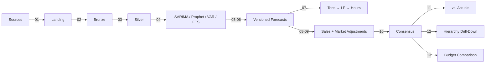

# IBP Forecast Agent

Lakehouse-driven, AI-powered IBP (Integrated Business Planning) forecasting framework for Microsoft Fabric. Implements multi-model statistical forecasting with versioned layering, demand-to-capacity translation, sales overrides, and hierarchical drill-down -- all on a medallion architecture.

## Architecture

See [docs/architecture/](docs/architecture/) for detailed Mermaid diagrams:

- **[System Overview](docs/architecture/system-overview.md)** -- end-to-end flow from sources to gold tables
- **[Data Model](docs/architecture/data-model.md)** -- forecast versioning, capacity, accuracy, and budget schemas
- **[Forecast Versioning](docs/architecture/forecast-versioning.md)** -- layering architecture and snapshot process



## Forecast Layering (Never Overwrite)

| Layer | Version Type | Source | Description |
|-------|-------------|--------|-------------|
| **Baseline** | `system` | Statistical models | Frozen at creation, never modified |
| **Sales Override** | `sales` | Sales team | Additive delta per SKU/plant/period |
| **Market Adjustment** | `market_adjusted` | Market planner | ±X% multiplicative scaling per market |
| **Consensus** | `consensus` | Pipeline | `(system + sales_delta) * market_factor` |

## Notebook Execution Order

### Phase 1 -- Core Capabilities

| # | Notebook | Layer | Description |
|---|----------|-------|-------------|
| 01 | `01_ingest_sources` | Landing | Copy source tables |
| 02 | `02_transform_bronze` | Bronze | Deduplicate, cleanse |
| 03 | `03_feature_engineering` | Silver | Lags, rolling stats, calendar features |
| 04 | `04_train_sarima` | Silver | SARIMA per grain (run in parallel) |
| 04 | `04_train_prophet` | Silver | Prophet per grain (run in parallel) |
| 04 | `04_train_var` | Silver | VAR multivariate (run in parallel) |
| 04 | `04_train_exp_smoothing` | Silver | Holt-Winters per grain (run in parallel) |
| 05 | `05_score_forecast` | Silver | Forward forecast with all models |
| 06 | `06_version_snapshot` | Gold | Stamp version_id + snapshot_month |
| 07 | `07_demand_to_capacity` | Gold | Tons → lineal feet → production hours |
| 08 | `08_sales_overrides` | Gold | Apply sales team adjustments |
| 09 | `09_market_adjustments` | Gold | Apply ±X% market scaling |
| 10 | `10_consensus_build` | Gold | Build final consensus forecast |
| 11 | `11_accuracy_tracking` | Gold | MAPE, bias by SKU group/plant/market |
| 12 | `12_aggregate_gold` | Gold | Hierarchical roll-ups for drill-down |
| 13 | `13_budget_comparison` | Gold | Budget vs. forecast with flags |

### Phase 2 -- Advanced Capabilities

| # | Notebook | Description |
|---|----------|-------------|
| P2_01 | `P2_01_external_signals` | Ingest construction/rates/inflation, compute correlations |
| P2_02 | `P2_02_scenario_modeling` | NCCA-only vs. NCCA+imports scenarios |
| P2_03 | `P2_03_sku_classification` | ABC/XYZ + runner/repeater/stranger |
| P2_04 | `P2_04_inventory_alignment` | FG inventory vs. demand, stock-out/overbuild flags |

## Modules (Shared Code)

| Module | Purpose |
|--------|---------|
| `config_module` | Lakehouse I/O, parameter parsing |
| `utils_module` | Metrics (RMSE, MAE, MAPE, bias), time splits, MLflow, versioning helpers |
| `feature_engineering_module` | Aggregation, lags, rolling stats, calendar features |
| `train_sarima_module` | SARIMA training per grain |
| `train_prophet_module` | Prophet training per grain |
| `train_var_module` | VAR multivariate training per grain |
| `train_exp_smoothing_module` | Holt-Winters training per grain |
| `scoring_module` | Forward forecasting for all model types |
| `versioning_module` | Version stamping, snapshot management, purge logic |
| `capacity_module` | Rolling production averages, tons→LF→hours translation |
| `override_module` | Sales override application, market adjustment, consensus builder |
| `accuracy_module` | Retrospective accuracy evaluation, model recommendations |

## Gold Tables Produced

| Table | Contents |
|-------|----------|
| `forecast_versions` | All versioned forecasts (system, sales, market_adjusted, consensus) |
| `accuracy_tracking` | MAPE, bias, RMSE per grain/version/snapshot |
| `model_recommendations` | Best model per grain based on accuracy |
| `capacity_translation` | Tons, lineal feet, production hours per plant/SKU/line |
| `budget_comparison_*` | Forecast vs. budget with over/under flags per hierarchy |
| `agg_*_by_*` | Hierarchical roll-ups per version type |
| `scenario_comparison` | Side-by-side scenario results |
| `sku_classifications` | ABC/XYZ + runner/repeater/stranger |
| `inventory_alignment` | FG inventory coverage, risk flags |
| `signal_importance` | External signal correlations per grain |

## Deployment

### Prerequisites

- Microsoft Fabric workspace
- Azure CLI logged in (`az login`)
- Python 3.11+ with `tomllib`

### Deploy

```bash
pwsh ./deploy/deploy-fabric.ps1
```

Creates lakehouses (Landing, Bronze, Silver, Gold) and deploys all notebooks to the Fabric workspace. Idempotent -- safe to re-run.

### Configuration

All settings in `deploy/deploy.config.toml`. Set `fabric.workspace_id` before deploying.

## Knowledge Transfer

This solution is designed for internal team sustainability:

- **Modules** are reusable building blocks with clear interfaces
- **Notebooks** follow a numbered execution order with print-based logging
- **Config** is centralized in a single TOML file
- **Versioning** is append-only; baselines are never overwritten
- All calculations (capacity translation, accuracy metrics, overrides) are explicit and auditable
