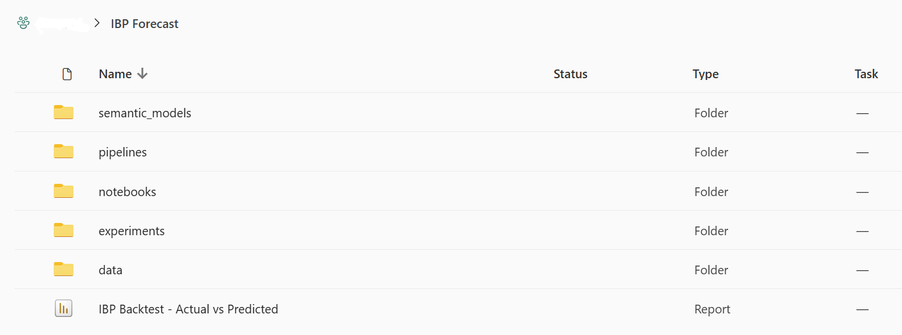
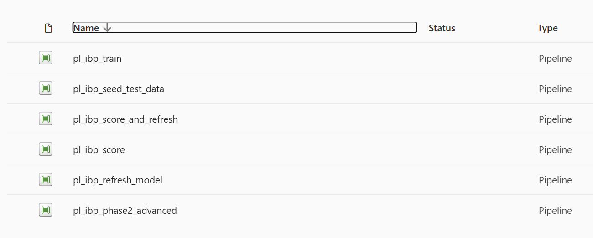
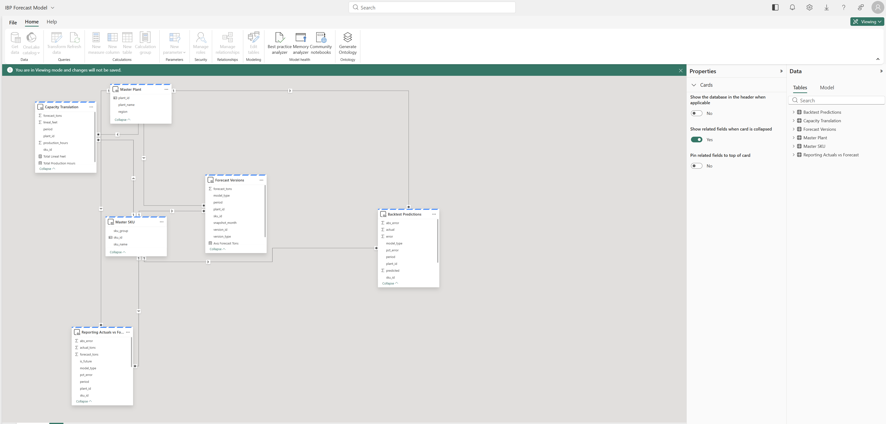
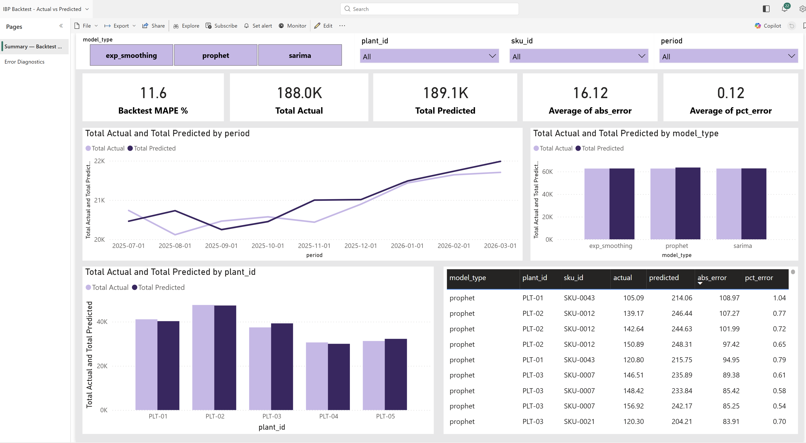
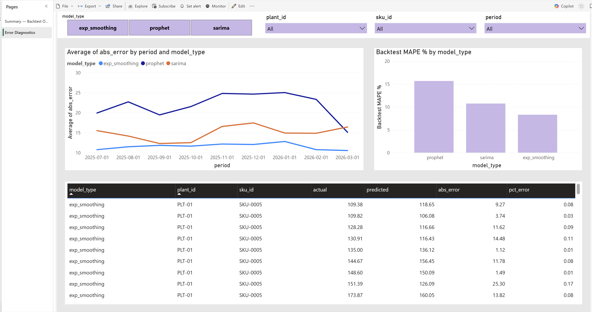
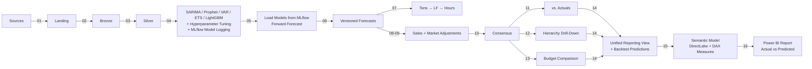

# IBP Forecast Agent

Lakehouse-driven, AI-powered IBP (Integrated Business Planning) forecasting framework for Microsoft Fabric. Implements multi-model statistical forecasting with per-grain hyperparameter tuning, MLflow model persistence, versioned layering, demand-to-capacity translation, sales overrides, and hierarchical drill-down -- all on a medallion architecture.

## Screenshots

| Workspace Folder Structure | Data Pipelines |
|---|---|
|  |  |

| Semantic Model (DirectLake) |
|---|
|  |

| Backtest Report — Summary | Backtest Report — Error Diagnostics |
|---|---|
|  |  |

## Architecture



See [docs/architecture/](docs/architecture/) for detailed Mermaid diagrams.

## Forecast Layering (Never Overwrite)

| Layer | Version Type | Source | Description |
|-------|-------------|--------|-------------|
| **Baseline** | `system` | Statistical models | Frozen at creation, never modified |
| **Sales Override** | `sales_override` | Sales team | Additive delta per SKU/plant/period |
| **Market Adjustment** | `market_adjusted` | Market planner | ±X% multiplicative scaling per market |
| **Consensus** | `consensus` | Pipeline | `(system + sales_delta) * market_factor` |

## MLOps: Train → Log → Score

The pipeline follows a strict **train-log-score** pattern with no silent fallbacks:

1. **Train (04_train_*)**: Each model type trains per grain (or globally for LightGBM), optionally runs randomized grid search for hyperparameter tuning, evaluates on a holdout split, then **refits on full data** and pickles all grain models into a single artifact.
2. **Log**: The pickled model dict is logged to MLflow as an artifact alongside aggregate metrics and best-params-per-grain.
3. **Score (05_score_forecast)**: Iterates over `models_enabled` from config, loads each model's pickled artifacts from MLflow by searching for the latest matching run. **No fallback refit** -- if models aren't found, the notebook fails hard so you know training didn't run.

Which models are trained and scored is controlled by a single config list:

```python
"models_enabled": ["sarima", "prophet", "var", "exp_smoothing", "lightgbm"]
```

Remove a model from this list to disable it everywhere — training, scoring, and reporting. The pipeline generator (`generate_pipelines.py`) reads the same list from `deploy.config.toml` to create the correct pipeline activities.

## Hyperparameter Tuning

The four statistical model types support **per-grain randomized grid search** with expanding-window time-series cross-validation. Controlled via `ibp_config.py`:

| Parameter | Default | Description |
|-----------|---------|-------------|
| `tuning_enabled` | `True` | Master switch for tuning across all models |
| `tuning_n_iter` | `10` | Number of random parameter combinations to evaluate per grain |
| `tuning_n_splits` | `3` | Number of expanding-window CV folds |
| `tuning_metric` | `"rmse"` | Optimization metric (`rmse`, `mae`, or `mape`) |

### How It Works

For each grain (e.g., PLT-01 × SKU-0023):

1. Sample `tuning_n_iter` random combinations from the model's parameter grid
2. For each combination, run expanding-window CV with `tuning_n_splits` folds
3. Select the combination with the best average CV score
4. Train the grain using those tuned params (instead of the global defaults)
5. Log the best params per grain to MLflow as an artifact

### Parameter Grids

**SARIMA**:
- `order`: (1,1,1), (0,1,1), (1,1,0), (2,1,1), (1,1,2), (0,1,2), (2,1,0)
- `seasonal_order`: (1,1,1,12), (0,1,1,12), (1,1,0,12), (2,1,1,12)

**Exponential Smoothing (Holt-Winters)**:
- `trend`: add, mul, None
- `seasonal`: add, mul, None
- `seasonal_periods`: 12

**Prophet**:
- `changepoint_prior_scale`: 0.001, 0.01, 0.05, 0.1, 0.5
- `yearly_seasonality`: True
- `weekly_seasonality`: False

**VAR**:
- `maxlags`: 4, 6, 8, 12
- `ic`: aic, bic, hqic

When `tuning_enabled = False`, all grains use the global defaults from config.

## Fabric Workspace Structure

```
IBP Forecast/
  data/
    lh_ibp_source           ← source data (or synthetic test data)
    lh_ibp_landing
    lh_ibp_bronze
    lh_ibp_silver
    lh_ibp_gold
  experiments/
    ibp_demand_forecast     ← MLflow experiment (all model runs)
  notebooks/
    main/
      00_generate_test_data
      01_ingest_sources
      ...
      14_build_reporting_view
      15_refresh_semantic_model
      16_create_report
      P2_01 ... P2_04
    modules/
      ibp_config            ← centralized config (all non-lakehouse params)
      config_module          ← lakehouse I/O helpers
      tuning_module          ← randomized grid search + time-series CV
      scoring_module         ← MLflow model loading + forward forecast
      ...
  pipelines/
    pl_ibp_seed_test_data       ← generates synthetic data
    pl_ibp_train                ← ingest → bronze → features → train (5 models parallel)
    pl_ibp_score                ← score → version (CDC) → gold enrichment → reporting
    pl_ibp_refresh_model        ← semantic model + backtest report (notebooks 15-16)
    pl_ibp_score_and_refresh    ← orchestrator: triggers score then refresh sequentially
    pl_ibp_phase2_advanced      ← external signals, scenarios, SKU classification, inventory
  reports/
    IBP Backtest - Actual vs Predicted  ← Power BI report (created by notebook 16)
  semantic_models/
    IBP Forecast Model      ← DirectLake semantic model (created by notebook 15)
```

## Pipeline Structure

Pipelines are modular so you can train independently from scoring:

| Pipeline | Activities | Purpose |
|----------|-----------|---------|
| `pl_ibp_seed_test_data` | 1 | Generate synthetic test data (run once) |
| `pl_ibp_train` | 8 | Ingest → Bronze → Features → Train 5 models in parallel |
| `pl_ibp_score` | 10 | Score → Version (CDC) → Capacity/Overrides/Adjustments → Consensus → Accuracy/Rollups/Budget → Reporting |
| `pl_ibp_refresh_model` | 2 | Create/update DirectLake semantic model + create/update Power BI backtest report |
| `pl_ibp_score_and_refresh` | 2 | Orchestrator: runs `pl_ibp_score` then `pl_ibp_refresh_model` sequentially |
| `pl_ibp_phase2_advanced` | 4 | External signals, scenarios, SKU classification, inventory alignment |

Typical workflow:
1. **First run**: seed → train → score_and_refresh
2. **Re-score (no retrain)**: score_and_refresh
3. **Full retrain + score**: train → score_and_refresh

## Notebook Execution Order

### Step 0 -- Test Data (Optional)

| # | Notebook | Description |
|---|----------|-------------|
| 00 | `00_generate_test_data` | Generate 42 months of realistic synthetic data for all source tables |
| 000 | `000_simulate_future_actuals` | Inject fake future actuals to test accuracy tracking (see below) |

### Training Pipeline (`pl_ibp_train`)

| # | Notebook | Layer | Description |
|---|----------|-------|-------------|
| 01 | `01_ingest_sources` | Landing | Copy source tables |
| 02 | `02_transform_bronze` | Bronze | Deduplicate, cleanse |
| 03 | `03_feature_engineering` | Silver | Lags, rolling stats, calendar features |
| 04 | `04_train_sarima` | Silver | SARIMA per grain + tuning + MLflow (parallel) |
| 04 | `04_train_prophet` | Silver | Prophet per grain + tuning + MLflow (parallel) |
| 04 | `04_train_var` | Silver | VAR multivariate + tuning + MLflow (parallel) |
| 04 | `04_train_exp_smoothing` | Silver | Holt-Winters per grain + tuning + MLflow (parallel) |
| 04 | `04_train_lightgbm` | Silver | LightGBM global pooled + MLflow (parallel) |

### Scoring Pipeline (`pl_ibp_score`)

| # | Notebook | Layer | Description |
|---|----------|-------|-------------|
| 05 | `05_score_forecast` | Silver | Load MLflow models, forward forecast all enabled models |
| 06 | `06_version_snapshot` | Gold | Stamp version_id + snapshot_month (with CDC -- skips if no changes) |
| 07 | `07_demand_to_capacity` | Gold | Tons → lineal feet → production hours |
| 08 | `08_sales_overrides` | Gold | Apply sales team adjustments |
| 09 | `09_market_adjustments` | Gold | Apply ±X% market scaling |
| 10 | `10_consensus_build` | Gold | Build final consensus forecast |
| 11 | `11_accuracy_tracking` | Gold | MAPE, bias by SKU group/plant/market |
| 12 | `12_aggregate_gold` | Gold | Hierarchical roll-ups for drill-down |
| 13 | `13_budget_comparison` | Gold | Budget vs. forecast with flags |
| 14 | `14_build_reporting_view` | Gold | Unified actuals-vs-forecast table + copy dimensions to gold |

### Semantic Model + Report Pipeline (`pl_ibp_refresh_model`)

| # | Notebook | Layer | Description |
|---|----------|-------|-------------|
| 15 | `15_refresh_semantic_model` | Gold | Create/update DirectLake semantic model via REST API + trigger refresh |
| 16 | `16_create_report` | Gold | Create/update Power BI backtest report (actual vs predicted) via REST API |

### Phase 2 -- Advanced Capabilities (`pl_ibp_phase2_advanced`)

| # | Notebook | Description |
|---|----------|-------------|
| P2_01 | `P2_01_external_signals` | Ingest construction/rates/inflation, enrich features |
| P2_02 | `P2_02_scenario_modeling` | Apply scenario multipliers (base/bull/bear/tariff) |
| P2_03 | `P2_03_sku_classification` | ABC/XYZ + runner/repeater/stranger |
| P2_04 | `P2_04_inventory_alignment` | FG inventory vs. demand, stock-out/overbuild flags |

## Modules

| Module | Purpose |
|--------|---------|
| `ibp_config` | Centralized config for all non-lakehouse parameters |
| `config_module` | Lakehouse path helpers, Delta read/write |
| `utils_module` | Metrics (RMSE, MAE, MAPE, R2, bias), MLflow helpers, rate-limit retry |
| `tuning_module` | Time-series CV, randomized grid search, per-model parameter grids |
| `feature_engineering_module` | Aggregation, lags, rolling stats, calendar features |
| `train_sarima_module` | SARIMA training + tuning + MLflow model persistence |
| `train_prophet_module` | Prophet training + tuning + MLflow model persistence |
| `train_var_module` | VAR multivariate training + tuning + MLflow model persistence |
| `train_exp_smoothing_module` | Holt-Winters training + tuning + MLflow model persistence |
| `train_lightgbm_module` | LightGBM global pooled training + MLflow model persistence |
| `scoring_module` | Load models from MLflow, forward forecast (no fallback refit) |
| `versioning_module` | Version stamping, snapshot management, purge logic |
| `capacity_module` | Rolling production averages, tons→LF→hours translation |
| `override_module` | Sales override application, market adjustment, consensus builder |
| `accuracy_module` | Retrospective accuracy evaluation |
| `schemas_module` | Single source of truth for ALL table schemas (source, silver, gold, phase 2), semantic model BIM generation, PySpark StructType helpers |

## Gold Tables Produced

| Table | Contents |
|-------|----------|
| `forecast_versions` | All versioned forecasts (system, sales_override, market_adjusted) |
| `consensus_forecast` | Final consensus forecast |
| `accuracy_tracking` | MAPE, bias, RMSE per grain/version |
| `capacity_translation` | Tons, lineal feet, production hours per plant/SKU/line |
| `budget_comparison` | Forecast vs. budget with over/under flags |
| `aggregated_forecast` | Hierarchical roll-ups per version type |
| `forecast_waterfall` | Wide-format: baseline + sales_delta + market_factor + consensus + actuals per grain/period |
| `raw_forecasts` | Forward forecasts from all enabled models (pre-versioning) |
| `reporting_actuals_vs_forecast` | Unified view: actual tons + forecast tons + error metrics + future flag |
| `backtest_predictions` | Union of all enabled models' backtest predictions with error metrics |
| `model_recommendations` | Best model per grain based on accuracy metrics |
| `scenario_forecasts` | Side-by-side scenario results |
| `sku_classifications` | ABC/XYZ + runner/repeater/stranger |
| `inventory_aligned_forecast` | FG inventory coverage, net requirements |
| `enriched_features` | Feature table enriched with external signals |

## Semantic Model

Notebook `15_refresh_semantic_model` creates or updates a DirectLake semantic model over the gold lakehouse via the Fabric REST API, then triggers a full refresh. It is **not** created at infrastructure deployment -- only the `semantic_models/` folder is created by the deploy script. The model itself is created/updated by the notebook when triggered by the `pl_ibp_refresh_model` pipeline.

All table schemas, BIM column definitions, DAX measures, and relationships are defined in a single module: `schemas_module.py`. Notebook 15 calls `build_bim(sql_endpoint, lakehouse_name)` to generate the full BIM JSON — **no inline schema definitions in any notebook**.

Notebook 15 also configures a **scheduled refresh** for the semantic model (default: daily at 06:00 UTC). This is controlled via `ibp_config.py` under `refresh_schedule_*` keys.

**Tables**: Forecast Versions, Reporting Actuals vs Forecast, Master SKU, Master Plant, Capacity Translation, Backtest Predictions, Forecast Waterfall, Accuracy Tracking

**Pre-built DAX Measures**:
- Total Forecast Tons / Total Actual Tons / Total Variance
- MAPE % / Bias % / Forecast Accuracy %
- Future Forecast Tons / Avg Forecast Tons
- Backtest MAPE % / Total Actual / Total Predicted
- Total Lineal Feet / Total Production Hours
- Raw Forecast Total

**Relationships**: Fact tables → Master SKU (sku_id), Fact tables → Master Plant (plant_id)

See [SEMANTIC_MODEL.md](SEMANTIC_MODEL.md) for the full semantic model schema (tables, columns, measures, relationships).

Notebook `14_build_reporting_view` copies `master_sku` and `master_plant` from bronze to gold, builds the unified actuals-vs-forecast table, copies `raw_forecasts` from silver to gold, unions backtest prediction tables from silver into `backtest_predictions` in gold, and ensures required Delta tables exist using `spark_schema()` from `schemas_module`.

## Backtest Report

Notebook `16_create_report` creates or updates a Power BI report (PBIR-Legacy format) via the Fabric REST API and places it in the `reports/` folder. The report layout was designed manually in Power BI and extracted via the `getDefinition` API. The full `report.json` and base theme (`CY25SU11`) are embedded directly in the notebook as readable JSON — no external files or base64 blobs in source.

The report is bound to the semantic model and has four pages:

**Page 1 — Summary (Backtest Overview)**
- **5 slicers**: model_type (button), plant_id, sku_id (dropdowns), period (range)
- **5 KPI cards**: Backtest MAPE %, Total Actual, Total Predicted, Avg Absolute Error, Avg % Error
- **Line chart**: Total Actual vs Total Predicted over time
- **Bar chart**: Actual vs Predicted by model type
- **Bar chart**: Actual vs Predicted by plant
- **Detail table**: model_type, plant_id, sku_id, actual, predicted, abs_error, pct_error

**Page 2 — Period Predictions**
- **4 slicers**: model_type (button), plant_id, sku_id (dropdowns), period (range)
- **Line chart**: Baseline tons over time by model type (Forecast Waterfall)
- **Bar chart**: Baseline tons by model type
- **Detail table**: model_type, plant_id, sku_id, period, baseline_tons, override_delta_tons, market_scale_factor, consensus_tons

**Page 3 — Backtest Error Diagnostics**
- **4 slicers**: model_type (button), plant_id, sku_id (dropdowns), period (range)
- **Line chart**: Average abs_error over time by model type
- **Bar chart**: Backtest MAPE % by model type
- **Detail table**: model_type, plant_id, sku_id, period, actual, predicted, abs_error, pct_error

**Page 4 — Model Evaluation**
- **6 slicers**: model_type (button), plant_id, sku_id (dropdowns), period (range), is_future (toggle)
- **Line chart**: Forecast vs Actual tons over time (Reporting Actuals vs Forecast)
- **Bar chart**: Forecast vs Actual by model type
- **Detail table**: all fields + MAPE %, Bias %, variance, snapshot_date

To update the layout: redesign in Power BI service, extract via `getDefinition` API, and replace the embedded JSON in the notebook.

If the report already exists in the workspace, the notebook updates its definition to match the embedded source. To preserve manual edits, remove the `updateDefinition` call.

## Accuracy Tracking: Predictions vs Actuals

The framework includes built-in accuracy tracking that compares prior predictions against actuals as new data arrives. This runs automatically each time the scoring pipeline executes.

### How It Works

1. **Notebook 11 (`accuracy_tracking`)** loads all prior `system` forecast snapshots from `forecast_versions` in gold, then loads the latest actuals from bronze. It joins them on grain + period and computes per-grain/per-snapshot metrics (MAPE, bias, RMSE, MAE, R2). Results are appended to `accuracy_tracking` in gold — so the full history of forecast-vs-actual comparisons accumulates over time.

2. **Notebook 14 (`build_reporting_view`)** rebuilds `reporting_actuals_vs_forecast` from the full forecast and actual datasets. Rows where actuals exist alongside forecasts get `abs_error`, `pct_error`, and `variance` computed. Rows with forecasts but no actuals are flagged `is_future = True`. This unified view powers the semantic model and Power BI report.

3. **Model recommendations**: `accuracy_module.recommend_model_by_grain()` ranks models per grain using the selected metric and writes the best model per grain to `model_recommendations`.

### When New Actuals Arrive

The pipeline is batch-driven (scheduled or manual trigger). Each run re-reads the current state of actuals from bronze — so any new data that has landed since the last run is automatically picked up. There is no event-driven trigger; the comparison happens every time the scoring pipeline runs. For "real-time" monitoring, schedule the pipeline to run at the desired frequency (daily, weekly, etc.) via the Fabric pipeline scheduler or the semantic model's scheduled refresh.

### Testing with Simulated Actuals

Notebook `000_simulate_future_actuals` lets you test the accuracy tracking loop without waiting for real data:

1. **Run the full pipeline** — `pl_ibp_train` → `pl_ibp_score_and_refresh` (generates 52-week forward forecasts)
2. **Run `000_simulate_future_actuals`** — reads forward forecasts, generates fake actuals for the first N weeks (default 12) by adding ±10% noise to predictions, appends to source orders table
3. **Re-run `pl_ibp_score_and_refresh`** — ingest picks up new actuals, accuracy tracking compares them against the original predictions
4. **Check results** — `accuracy_tracking` table shows per-grain/per-model MAPE, bias, RMSE for the overlap periods; `reporting_actuals_vs_forecast` flips previously-future rows to have actual values

Parameters (set via pipeline or notebook UI):

| Parameter | Default | Description |
|-----------|---------|-------------|
| `simulate_weeks` | `12` | Number of future weeks to generate actuals for |
| `noise_pct` | `0.10` | Noise level (±10% by default) |
| `seed` | `99` | Random seed for reproducibility |

## Configuration Reference

All runtime configuration lives in `deploy/assets/notebooks/modules/ibp_config.py`. Lakehouse IDs are injected at deploy time via parameter cells.

### Naming Convention

| Parameter | Default | Description |
|-----------|---------|-------------|
| `naming_prefix` | `""` | Prepended to all Fabric artifact names (folders, lakehouses, experiments, semantic models, reports) |
| `naming_suffix` | `""` | Appended to all Fabric artifact names. Use `"_dev"` / `"_staging"` / `""` to isolate environments |

The `named(base)` helper applies prefix + suffix at runtime. Example: `named("lh_ibp_source")` returns `"lh_ibp_source_dev"`. The deploy script (`deploy-fabric.ps1`) reads `prefix` and `suffix` from `deploy.config.toml` `[naming]` and applies them to folder names, lakehouse names, and experiment names.

### Data Schema

| Parameter | Default | Description |
|-----------|---------|-------------|
| `date_column` | `"period_date"` | Raw date column in source tables |
| `feature_date_column` | `"period"` | Date column after feature engineering (YYYY-MM format) |
| `frequency` | `"W"` | Time series frequency (`"M"`, `"W"`, or `"D"`). All seasonal periods, lag windows, date offsets, and tuning grids auto-derive via `freq_params()` |
| `target_column` | `"tons"` | Target variable for forecasting |
| `grain_columns` | `["plant_id", "sku_id"]` | Columns that define a unique time series |
| `extended_grains` | `["plant_id", "sku_group", "customer_id", "market_id"]` | Extended grain for drill-down |
| `feature_columns` | `["price_per_ton", "lead_time_days", "promo_flag", "safety_stock_tons"]` | Exogenous features for VAR and feature engineering |
| `source_tables` | 14 tables | List of all source tables to ingest |

### Frequency Map (`freq_params()`)

Changing `frequency` in the config automatically adapts every derived parameter below. These values are accessed via `freq_params("key")` from any notebook or module.

| Key | M (Monthly) | W (Weekly) | D (Daily) |
|-----|-------------|------------|-----------|
| `code` | `"MS"` | `"W-MON"` | `"D"` |
| `seasonal_periods` | 12 | 52 | 365 |
| `periods_per_year` | 12 | 52 | 365 |
| `default_lags` | [1,2,3,6,12] | [1,2,4,13,52] | [1,7,14,30,365] |
| `default_rolling` | [3,6,12] | [4,13,52] | [7,30,90] |
| `offset_kwarg` | `"months"` | `"weeks"` | `"days"` |
| `snapshot_fmt` | `"%Y-%m"` | `"%Y-W%W"` | `"%Y-%m-%d"` |
| `min_train_periods` | 24 | 104 | 365 |
| `var_maxlags` | 12 | 13 | 30 |
| `sarima_seasonal_s` | 12 | 52 | 7 |
| `tuning_grid_maxlags` | [4,6,8,12] | [4,8,13,26] | [7,14,30] |

### Enabled Models

| Parameter | Default | Description |
|-----------|---------|-------------|
| `models_enabled` | `["sarima", "prophet", "var", "exp_smoothing", "lightgbm"]` | Which models to train, score, and include in reporting. Also controls pipeline activities via `deploy.config.toml`. |

### Forecasting

| Parameter | Default | Description |
|-----------|---------|-------------|
| `forecast_horizon` | `52` | Number of periods to forecast forward (52 weeks = 1 year) |
| `test_split_ratio` | `0.2` | Holdout ratio for train/test evaluation |

### SARIMA

| Parameter | Default | Description |
|-----------|---------|-------------|
| `sarima_order` | `[1, 1, 1]` | (p, d, q) -- AR order, differencing, MA order |

### Prophet

| Parameter | Default | Description |
|-----------|---------|-------------|
| `prophet_yearly_seasonality` | `True` | Enable yearly seasonality component |
| `prophet_weekly_seasonality` | `False` | Enable weekly seasonality (disabled for monthly data) |
| `prophet_changepoint_prior` | `0.30` | Flexibility of trend changepoints (higher = more flexible) |
| `prophet_seasonality_mode` | `"multiplicative"` | Seasonality mode (`additive` or `multiplicative`) |
| `prophet_yearly_fourier_order` | `5` | Fourier terms for yearly seasonality (lower = smoother) |

### VAR (Vector Autoregression)

| Parameter | Default | Description |
|-----------|---------|-------------|
| `var_maxlags` | derived | Maximum lag order (auto-set by `freq_params()`: M=12, W=13, D=30) |
| `var_ic` | `"aic"` | Information criterion for lag selection (aic, bic, hqic) |

### Exponential Smoothing (Holt-Winters)

| Parameter | Default | Description |
|-----------|---------|-------------|
| `exp_smoothing_trend` | `"add"` | Trend component type (add, mul, None) |
| `exp_smoothing_seasonal` | `"add"` | Seasonal component type (add, mul, None) |
| `exp_smoothing_seasonal_periods` | derived | Number of periods in a seasonal cycle (auto-set by `freq_params()`: M=12, W=52, D=365) |

### LightGBM (Global Pooled)

| Parameter | Default | Description |
|-----------|---------|-------------|
| `lightgbm_n_estimators` | `800` | Number of boosting rounds |
| `lightgbm_max_depth` | `7` | Maximum tree depth |
| `lightgbm_learning_rate` | `0.02` | Boosting learning rate |
| `lightgbm_num_leaves` | `40` | Maximum number of leaves per tree |
| `lightgbm_min_child_samples` | `10` | Minimum samples per leaf node |

LightGBM trains a single global model pooled across all grains (with label-encoded grain IDs as features). Feature columns are derived automatically from `freq_params()` — lag features, rolling statistics, calendar features, and domain features. For forward scoring, predictions are generated recursively: each step's prediction is fed back as lag input for the next step.

### Hyperparameter Tuning

| Parameter | Default | Description |
|-----------|---------|-------------|
| `tuning_enabled` | `True` | Enable per-grain randomized grid search |
| `tuning_n_iter` | `10` | Random parameter combinations per grain |
| `tuning_n_splits` | `3` | Expanding-window CV folds |
| `tuning_metric` | `"rmse"` | Optimization metric (rmse, mae, mape) |

### MLflow / Experiment Tracking

| Parameter | Default | Description |
|-----------|---------|-------------|
| `experiment_name` | `"ibp_demand_forecast"` | MLflow experiment name (created in experiments/ folder) |
| `registered_model_prefix` | `"ibp_model"` | Prefix for MLflow run names |

### Versioning

| Parameter | Default | Description |
|-----------|---------|-------------|
| `output_table` | `"forecast_versions"` | Gold table for all versioned forecasts |
| `keep_n_snapshots` | `24` | Max snapshots retained (older purged) |

### Capacity Translation

| Parameter | Default | Description |
|-----------|---------|-------------|
| `capacity_output_table` | `"capacity_translation"` | Output table name |
| `production_history_table` | `"production_history"` | Source production data |
| `rolling_periods` | `3` | Rolling average window for production metrics (periods per `frequency`) |
| `tons_to_lf_factor` | `2000` | Conversion factor: tons → lineal feet |
| `width_column` | `"width_inches"` | Column for product width |
| `speed_column` | `"line_speed_fpm"` | Column for line speed (feet per minute) |
| `line_id_column` | `"line_id"` | Column for production line identifier |

### Sales Overrides & Market Adjustments

| Parameter | Default | Description |
|-----------|---------|-------------|
| `overrides_table` | `"sales_overrides"` | Source table for sales overrides |
| `adjustments_table` | `"market_adjustments"` | Source table for market adjustments |
| `default_scale_factor` | `1.0` | Default market adjustment multiplier |

### Tables: Intermediate / Pipeline

| Parameter | Default | Description |
|-----------|---------|-------------|
| `feature_table` | `"feature_table"` | Silver table produced by feature engineering |
| `raw_forecasts_table` | `"raw_forecasts"` | Silver table holding combined raw model forecasts |
| `primary_table` | `"orders"` | Primary demand table used for actuals comparison |
| `prediction_tables` | derived from `models_enabled` | Per-model prediction tables in silver (auto-generated as `{model}_predictions`). Use `prediction_table_for("model_type")` helper. |
| `backtest_predictions_table` | `"backtest_predictions"` | Gold table with unioned backtest predictions from all models |
| `dimension_tables` | `["master_sku", "master_plant"]` | Dimension tables copied from bronze to gold for reporting joins |
| `model_recommendations_table` | `"model_recommendations"` | Gold table with recommended model per grain based on accuracy |
| `agg_grand_total_table` | `"agg_grand_total"` | Gold table with grand-total aggregation across all grains |
| `version_types` | `["system", "sales", "consensus"]` | Version types to aggregate in gold roll-ups |

### Accuracy Tracking

| Parameter | Default | Description |
|-----------|---------|-------------|
| `accuracy_table` | `"accuracy_tracking"` | Output table for accuracy metrics |
| `accuracy_recommendation_metric` | `"mape"` | Metric used to rank models for per-grain recommendations (mape, rmse, mae) |

### Hierarchy / Aggregation

| Parameter | Default | Description |
|-----------|---------|-------------|
| `hierarchy_levels` | `["market_id", "plant_id", "sku_group", "sku_id", "customer_id"]` | Drill-down levels for aggregation |

### Budget Comparison

| Parameter | Default | Description |
|-----------|---------|-------------|
| `budget_table` | `"budget_volumes"` | Source budget table |
| `comparison_output_table` | `"budget_comparison"` | Output comparison table |
| `over_forecast_threshold` | `0.10` | Flag threshold for over-forecasting (10%) |
| `under_forecast_threshold` | `-0.10` | Flag threshold for under-forecasting (-10%) |

### Feature Engineering

| Parameter | Default | Description |
|-----------|---------|-------------|
| `lag_periods` | derived | Lag periods (auto-set by `freq_params()`: M=[1,2,3,6,12], W=[1,2,4,13,52], D=[1,7,14,30,365]) |
| `rolling_windows` | derived | Rolling window sizes (auto-set by `freq_params()`: M=[3,6,12], W=[4,13,52], D=[7,30,90]) |

### Phase 2: External Signals

| Parameter | Default | Description |
|-----------|---------|-------------|
| `external_signals_enabled` | `False` | Master switch -- skip external signals processing when disabled |
| `signal_columns` | `["construction_index", "interest_rate", "inflation_rate", "tariff_rate"]` | External signal columns |
| `signals_table` | `"external_signals"` | Source table for external signals |
| `signal_importance_table` | `"signal_importance"` | Output table for signal feature-importance scores |
| `feature_table_enriched` | `"feature_table_enriched"` | Output table for feature table enriched with external signals |

### Phase 2: Scenario Modeling

| Parameter | Default | Description |
|-----------|---------|-------------|
| `scenarios_enabled` | `False` | Master switch -- skip scenario modeling when disabled |
| `scenarios_table` | `"scenario_definitions"` | Source table with volume/price multipliers |
| `scenario_comparison_table` | `"scenario_comparison"` | Output table with side-by-side scenario results |

### Phase 2: SKU Classification

| Parameter | Default | Description |
|-----------|---------|-------------|
| `sku_classification_enabled` | `False` | Master switch -- skip SKU classification when disabled |
| `sku_classification_output_table` | `"sku_classifications"` | Output table |
| `runner_threshold` | `0.8` | Frequency threshold for Runner class |
| `repeater_threshold` | `0.95` | Frequency threshold for Repeater class |
| `xyz_cv_threshold_x` | `0.5` | CV threshold for X class (low variability) |
| `xyz_cv_threshold_y` | `1.0` | CV threshold for Y class (medium variability) |

### Phase 2: Inventory Alignment

| Parameter | Default | Description |
|-----------|---------|-------------|
| `inventory_table` | `"inventory_finished_goods"` | Source table for finished-goods inventory |
| `inventory_alignment_table` | `"inventory_alignment"` | Output table with inventory vs. demand alignment |
| `inventory_near_term_periods` | `3` | Periods of forward demand to use for near-term coverage |
| `inventory_stockout_threshold_periods` | `1` | Coverage below this (in periods) flags stock-out risk |
| `inventory_overbuild_threshold_periods` | `6` | Coverage above this (in periods) flags overbuild risk |

### Semantic Model / Reporting

| Parameter | Default | Description |
|-----------|---------|-------------|
| `reporting_table` | `"reporting_actuals_vs_forecast"` | Unified reporting table in gold |
| `semantic_model_name` | `"IBP Forecast Model"` | Name of the DirectLake semantic model |
| `semantic_models_folder` | `"semantic_models"` | Fabric workspace folder for semantic models |
| `reports_folder` | `"reports"` | Fabric workspace folder for Power BI reports |
| `report_name` | `"IBP Backtest - Actual vs Predicted"` | Display name of the Power BI report |
| `report_description` | `"Generated PBIR-Legacy report..."` | Description metadata for the Power BI report |
| `refresh_schedule_enabled` | `True` | Enable daily scheduled refresh for the semantic model |
| `refresh_schedule_time` | `"06:00"` | Time of day for scheduled refresh (24h format) |
| `refresh_schedule_timezone` | `"UTC"` | Timezone for the refresh schedule |

### Lakehouse Names

| Parameter | Default | Description |
|-----------|---------|-------------|
| `lakehouse_names.source` | `"lh_ibp_source"` | Display name of the source lakehouse (used by `resolve_lakehouse_id`) |
| `lakehouse_names.landing` | `"lh_ibp_landing"` | Display name of the landing lakehouse |
| `lakehouse_names.bronze` | `"lh_ibp_bronze"` | Display name of the bronze lakehouse |
| `lakehouse_names.silver` | `"lh_ibp_silver"` | Display name of the silver lakehouse |
| `lakehouse_names.gold` | `"lh_ibp_gold"` | Display name of the gold lakehouse |

### Test Data Generation

| Parameter | Default | Description |
|-----------|---------|-------------|
| `n_skus` | `50` | Number of synthetic SKUs |
| `n_plants` | `5` | Number of synthetic plants |
| `n_customers` | `20` | Number of synthetic customers |
| `n_markets` | `4` | Number of synthetic markets |
| `n_production_lines` | `10` | Number of production lines |
| `history_periods` | `36` | Periods of synthetic history (at whatever `frequency` is set to) |
| `seed` | `42` | Random seed for reproducibility |
| `demand_shock_prob` | `0.06` | Per-period probability of a demand shock (+/- 30-60%) |
| `intermittent_pct` | `0.10` | Fraction of SKUs with intermittent (sporadic) demand |
| `price_elasticity_range` | `[-0.8, -0.3]` | Price elasticity range (per SKU, inverse effect on demand) |
| `promo_lift_range` | `[0.15, 0.40]` | Promotion lift range (demand multiplier when promo_flag=1) |

## Notebook Build System

The repo uses a two-directory model to keep source notebooks human-readable while producing the exact format Fabric expects:

```
deploy/
  assets/notebooks/       ← SOURCE OF TRUTH (what you edit and commit)
    main/*.py               Plain Python with simple markers
    modules/*.py            Module notebooks
  build/notebooks/        ← AUTO-GENERATED (never edit, gitignored)
    main/*.py               Fabric Git source format
    modules/*.py            With metadata, cell separators, real lakehouse IDs
```

### How it works

`convert_notebooks.py` reads from `assets/` and writes to `build/` during each deployment. The transformation:

| Feature | `assets/` (source) | `build/` (deploy artifact) |
|---------|-------------------|---------------------------|
| **Format** | Plain Python | Fabric Git source format |
| **Lakehouse IDs** | Empty strings `""` | Real GUIDs injected |
| **Cell boundaries** | Implicit (code blocks) | Explicit `# CELL **` / `# METADATA **` separators |
| **Parameter cells** | `# @parameters` / `# @end_parameters` markers | `"tags": ["parameters"]` in cell metadata |
| **Module imports** | `# %run ../modules/ibp_config` | `%run ibp_config` (Fabric resolves by name) |
| **Header metadata** | None | Kernel info, lakehouse bindings, known lakehouses |

### Parameter injection

Notebooks receive two kinds of configuration:

1. **Lakehouse IDs** -- injected via Fabric parameter cells. The `# @parameters` block in each notebook declares empty-string defaults. At deploy time, `convert_notebooks.py` replaces these with real GUIDs. At runtime, pipelines override them with expression parameters (`@pipeline().parameters.silver_lakehouse_id`).

2. **Everything else** -- centralized in `ibp_config.py` via the `cfg("key")` function. Model hyperparameters, table names, thresholds, column mappings -- all in one place. Change once, applies everywhere.

### Automatic parameter resolution (manual runs)

Every notebook calls `resolve_lakehouse_id()` after the module imports. When a pipeline injects the ID, the value passes through unchanged. When you run a notebook **manually** (no pipeline), the parameter is an empty string, so the resolver discovers the lakehouse by name via the Fabric API using the `lakehouse_names` mapping in `ibp_config.py`. This means notebooks work both ways — via pipeline or standalone.

```python
# In a notebook:
# @parameters
silver_lakehouse_id = ""        # ← empty default; pipeline injects real ID
# @end_parameters

# %run ../modules/ibp_config    # ← provides cfg(), logger
# %run ../modules/config_module # ← provides resolve_lakehouse_id, read/write helpers

silver_lakehouse_id = resolve_lakehouse_id(silver_lakehouse_id, "silver")  # ← auto-discovers if empty
target_column = cfg("target_column")  # ← centralized config
```

### Adding or editing notebooks

1. Edit the `.py` file in `deploy/assets/notebooks/main/` (or `modules/`)
2. Run `deploy-fabric.ps1` -- it calls `convert_notebooks.py` automatically
3. The converted notebooks in `build/` are uploaded to Fabric via REST API

Never edit files in `build/` directly -- they are overwritten on every deployment.

## Deployment

### Prerequisites

- Microsoft Fabric workspace with capacity
- Azure CLI logged in (`az login`)
- Python 3.11+ with `tomllib`

### Deploy

```bash
pwsh ./deploy/deploy-fabric.ps1
```

The script performs 8 idempotent steps:

| Step | Description |
|------|-------------|
| 1 | Create project folder (`IBP Forecast/`) |
| 2 | Create sub-folders: `data/`, `notebooks/`, `pipelines/`, `experiments/`, `semantic_models/`, `reports/`, `main/`, `modules/` |
| 3 | Create/verify 5 lakehouses in `data/` folder + MLflow experiment in `experiments/` |
| 4 | Run `convert_notebooks.py` to transform `assets/` → `build/` with real lakehouse bindings |
| 5 | Deploy module notebooks in parallel |
| 6 | Deploy main notebooks in parallel |
| 7 | Run `generate_pipelines.py` to produce pipeline JSON definitions |
| 8 | Deploy 6 data pipelines into `pipelines/` folder |

Safe to re-run -- existing items are updated, not duplicated.

### Deploy Configuration

Deployment-time settings live in `deploy/deploy.config.toml`:

- `fabric.workspace_id` or `fabric.workspace_name` -- target workspace
- `lakehouses.*_name` / `*_id` -- leave IDs empty to auto-create
- `source.source_lakehouse_name` -- source data lakehouse
- `mlflow.experiment_name` -- MLflow experiment name

### Pipeline Execution

After deployment, trigger pipelines from the Fabric UI or via the REST API:

1. **`pl_ibp_seed_test_data`** -- run once to generate synthetic data
2. **`pl_ibp_train`** -- ingest, transform, feature engineer, train 5 models
3. **`pl_ibp_score_and_refresh`** -- score, enrich gold, build reporting view, create/update semantic model + backtest report
4. **`pl_ibp_phase2_advanced`** -- advanced analytics (run after Phase 1)

## Data Types

All date columns throughout the pipeline are stored as proper `DateType` in Delta Lake (not strings). This ensures correct sorting, filtering, and aggregation in both Spark and the Power BI semantic model.

| Column | Spark Type | Semantic Model Type | Used In |
|--------|-----------|-------------------|---------|
| `period`, `period_date` | `DateType` | `dateTime` | All tables |
| `snapshot_date`, `snapshot_month` | `DateType` | `dateTime` | Gold tables |
| `shipped_date` | `DateType` | -- | Shipments (source) |
| `created_at`, `evaluated_at` | `TimestampType` | -- | Versioning, accuracy |

Type definitions are centralized in `schemas_module.py` via the `_SPARK_TYPE_MAP` dict and per-table column schemas. The semantic model BIM generator reads the same schemas.

## CI/CD

Pre-built pipeline templates for GitHub Actions and Azure DevOps are in `deploy/cicd/`. See `deploy/cicd/README.md` for setup instructions.

### Configuration

The `[cicd]` section in `deploy.config.toml` controls optional Fabric Git integration:

```toml
[cicd]
enabled           = false          # set to true to enable
provider          = ""             # "github" or "azure-devops"
organization_name = ""             # GitHub org or Azure DevOps org
project_name      = ""             # Azure DevOps project (leave empty for GitHub)
repository_name   = ""             # Repository name
branch_name       = "main"         # Branch to sync
directory_name    = "/"            # Root directory in repo for Fabric items
```

When `enabled = false` (the default), the deployment script runs without any Git integration. Set to `true` and fill in the required fields to connect your Fabric workspace to a Git repository.

### Templates

| File | Platform | Trigger |
|------|----------|---------|
| `deploy/cicd/github-actions-deploy.yml` | GitHub Actions | Push to `main` under `deploy/**` or manual |
| `deploy/cicd/azure-pipelines-deploy.yml` | Azure DevOps | Push to `main` under `deploy/*` |

## Design Principles

- **No silent fallbacks**: if models aren't trained, scoring fails loud
- **Enterprise config**: all non-lakehouse params centralized in `ibp_config.py`, lakehouse IDs injected at deploy time via parameter cells
- **Single source of truth**: `.py` files in `assets/notebooks/` are the only files you edit; `build/` is auto-generated and gitignored. All table schemas are centralized in `schemas_module.py` — no inline schema definitions in any notebook
- **Append-only versioning**: baselines are never overwritten, all layers preserved
- **Change Data Capture**: `06_version_snapshot` hashes forecast data and skips creating a new version if content hasn't changed
- **MLflow-native**: models persisted and loaded via MLflow artifacts, metrics tracked per run
- **Per-grain tuning**: each time series gets its own optimized hyperparameters
- **Modular pipelines**: train and score are separate pipelines so you can re-score without retraining
- **Auditable**: every calculation is explicit with structured Python logging (`logging` module)
