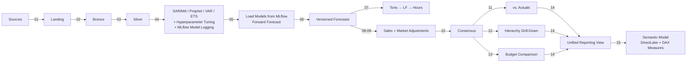

# IBP Forecast Agent

Lakehouse-driven, AI-powered IBP (Integrated Business Planning) forecasting framework for Microsoft Fabric. Implements multi-model statistical forecasting with per-grain hyperparameter tuning, MLflow model persistence, versioned layering, demand-to-capacity translation, sales overrides, and hierarchical drill-down -- all on a medallion architecture.

## Architecture



See [docs/architecture/](docs/architecture/) for detailed Mermaid diagrams.

## Forecast Layering (Never Overwrite)

| Layer | Version Type | Source | Description |
|-------|-------------|--------|-------------|
| **Baseline** | `system` | Statistical models | Frozen at creation, never modified |
| **Sales Override** | `sales_override` | Sales team | Additive delta per SKU/plant/period |
| **Market Adjustment** | `market_adjusted` | Market planner | ±X% multiplicative scaling per market |
| **Consensus** | `consensus` | Pipeline | `(system + sales_delta) * market_factor` |

## MLOps: Train → Log → Score

The pipeline follows a strict **train-log-score** pattern with no silent fallbacks:

1. **Train (04_train_*)**: Each model type trains per grain, optionally runs randomized grid search for hyperparameter tuning, evaluates on a holdout split, then **refits on full data** and pickles all grain models into a single artifact.
2. **Log**: The pickled model dict is logged to MLflow as an artifact alongside aggregate metrics and best-params-per-grain.
3. **Score (05_score_forecast)**: Loads the pickled models from MLflow by searching for the latest matching run. **No fallback refit** -- if models aren't found, the notebook fails hard so you know training didn't run.

## Hyperparameter Tuning

All four model types support **per-grain randomized grid search** with expanding-window time-series cross-validation. Controlled via `ibp_config.py`:

| Parameter | Default | Description |
|-----------|---------|-------------|
| `tuning_enabled` | `True` | Master switch for tuning across all models |
| `tuning_n_iter` | `10` | Number of random parameter combinations to evaluate per grain |
| `tuning_n_splits` | `3` | Number of expanding-window CV folds |
| `tuning_metric` | `"rmse"` | Optimization metric (`rmse`, `mae`, or `mape`) |

### How It Works

For each grain (e.g., PLT-01 × SKU-0023):

1. Sample `tuning_n_iter` random combinations from the model's parameter grid
2. For each combination, run expanding-window CV with `tuning_n_splits` folds
3. Select the combination with the best average CV score
4. Train the grain using those tuned params (instead of the global defaults)
5. Log the best params per grain to MLflow as an artifact

### Parameter Grids

**SARIMA**:
- `order`: (1,1,1), (0,1,1), (1,1,0), (2,1,1), (1,1,2), (0,1,2), (2,1,0)
- `seasonal_order`: (1,1,1,12), (0,1,1,12), (1,1,0,12), (2,1,1,12)

**Exponential Smoothing (Holt-Winters)**:
- `trend`: add, mul, None
- `seasonal`: add, mul, None
- `seasonal_periods`: 12

**Prophet**:
- `changepoint_prior_scale`: 0.001, 0.01, 0.05, 0.1, 0.5
- `yearly_seasonality`: True
- `weekly_seasonality`: False

**VAR**:
- `maxlags`: 4, 6, 8, 12
- `ic`: aic, bic, hqic

When `tuning_enabled = False`, all grains use the global defaults from config.

## Fabric Workspace Structure

```
IBP Forecast/
  data/
    lh_ibp_source           ← source data (or synthetic test data)
    lh_ibp_landing
    lh_ibp_bronze
    lh_ibp_silver
    lh_ibp_gold
  experiments/
    ibp_demand_forecast     ← MLflow experiment (all model runs)
  notebooks/
    main/
      00_generate_test_data
      01_ingest_sources
      ...
      14_build_reporting_view
      15_refresh_semantic_model
      P2_01 ... P2_04
    modules/
      ibp_config            ← centralized config (all non-lakehouse params)
      config_module          ← lakehouse I/O helpers
      tuning_module          ← randomized grid search + time-series CV
      scoring_module         ← MLflow model loading + forward forecast
      ...
  pipelines/
    pl_ibp_seed_test_data       ← generates synthetic data
    pl_ibp_train                ← ingest → bronze → features → train (4 models parallel)
    pl_ibp_score                ← score → version (CDC) → gold enrichment → reporting
    pl_ibp_refresh_model        ← create/update DirectLake semantic model + refresh
    pl_ibp_score_and_refresh    ← orchestrator: triggers score then refresh sequentially
    pl_ibp_phase2_advanced      ← external signals, scenarios, SKU classification, inventory
  semantic_models/
    IBP Forecast Model      ← DirectLake semantic model (created by notebook 15 at runtime)
```

## Pipeline Structure

Pipelines are modular so you can train independently from scoring:

| Pipeline | Activities | Purpose |
|----------|-----------|---------|
| `pl_ibp_seed_test_data` | 1 | Generate synthetic test data (run once) |
| `pl_ibp_train` | 7 | Ingest → Bronze → Features → Train 4 models in parallel |
| `pl_ibp_score` | 10 | Score → Version (CDC) → Capacity/Overrides/Adjustments → Consensus → Accuracy/Rollups/Budget → Reporting |
| `pl_ibp_refresh_model` | 1 | Create/update the DirectLake semantic model + trigger refresh |
| `pl_ibp_score_and_refresh` | 2 | Orchestrator: runs `pl_ibp_score` then `pl_ibp_refresh_model` sequentially |
| `pl_ibp_phase2_advanced` | 4 | External signals, scenarios, SKU classification, inventory alignment |

Typical workflow:
1. **First run**: seed → train → score_and_refresh
2. **Re-score (no retrain)**: score_and_refresh
3. **Full retrain + score**: train → score_and_refresh

## Notebook Execution Order

### Step 0 -- Test Data (Optional)

| # | Notebook | Description |
|---|----------|-------------|
| 00 | `00_generate_test_data` | Generate 42 months of realistic synthetic data for all source tables |

### Training Pipeline (`pl_ibp_train`)

| # | Notebook | Layer | Description |
|---|----------|-------|-------------|
| 01 | `01_ingest_sources` | Landing | Copy source tables |
| 02 | `02_transform_bronze` | Bronze | Deduplicate, cleanse |
| 03 | `03_feature_engineering` | Silver | Lags, rolling stats, calendar features |
| 04 | `04_train_sarima` | Silver | SARIMA per grain + tuning + MLflow (parallel) |
| 04 | `04_train_prophet` | Silver | Prophet per grain + tuning + MLflow (parallel) |
| 04 | `04_train_var` | Silver | VAR multivariate + tuning + MLflow (parallel) |
| 04 | `04_train_exp_smoothing` | Silver | Holt-Winters per grain + tuning + MLflow (parallel) |

### Scoring Pipeline (`pl_ibp_score`)

| # | Notebook | Layer | Description |
|---|----------|-------|-------------|
| 05 | `05_score_forecast` | Silver | Load MLflow models, forward forecast all 4 types |
| 06 | `06_version_snapshot` | Gold | Stamp version_id + snapshot_month (with CDC -- skips if no changes) |
| 07 | `07_demand_to_capacity` | Gold | Tons → lineal feet → production hours |
| 08 | `08_sales_overrides` | Gold | Apply sales team adjustments |
| 09 | `09_market_adjustments` | Gold | Apply ±X% market scaling |
| 10 | `10_consensus_build` | Gold | Build final consensus forecast |
| 11 | `11_accuracy_tracking` | Gold | MAPE, bias by SKU group/plant/market |
| 12 | `12_aggregate_gold` | Gold | Hierarchical roll-ups for drill-down |
| 13 | `13_budget_comparison` | Gold | Budget vs. forecast with flags |
| 14 | `14_build_reporting_view` | Gold | Unified actuals-vs-forecast table + copy dimensions to gold |

### Semantic Model Pipeline (`pl_ibp_refresh_model`)

| # | Notebook | Layer | Description |
|---|----------|-------|-------------|
| 15 | `15_refresh_semantic_model` | Gold | Create/update DirectLake semantic model via REST API + trigger refresh |

### Phase 2 -- Advanced Capabilities (`pl_ibp_phase2_advanced`)

| # | Notebook | Description |
|---|----------|-------------|
| P2_01 | `P2_01_external_signals` | Ingest construction/rates/inflation, enrich features |
| P2_02 | `P2_02_scenario_modeling` | Apply scenario multipliers (base/bull/bear/tariff) |
| P2_03 | `P2_03_sku_classification` | ABC/XYZ + runner/repeater/stranger |
| P2_04 | `P2_04_inventory_alignment` | FG inventory vs. demand, stock-out/overbuild flags |

## Modules

| Module | Purpose |
|--------|---------|
| `ibp_config` | Centralized config for all non-lakehouse parameters |
| `config_module` | Lakehouse path helpers, Delta read/write |
| `utils_module` | Metrics (RMSE, MAE, MAPE, R2, bias), MLflow helpers, rate-limit retry |
| `tuning_module` | Time-series CV, randomized grid search, per-model parameter grids |
| `feature_engineering_module` | Aggregation, lags, rolling stats, calendar features |
| `train_sarima_module` | SARIMA training + tuning + MLflow model persistence |
| `train_prophet_module` | Prophet training + tuning + MLflow model persistence |
| `train_var_module` | VAR multivariate training + tuning + MLflow model persistence |
| `train_exp_smoothing_module` | Holt-Winters training + tuning + MLflow model persistence |
| `scoring_module` | Load models from MLflow, forward forecast (no fallback refit) |
| `versioning_module` | Version stamping, snapshot management, purge logic |
| `capacity_module` | Rolling production averages, tons→LF→hours translation |
| `override_module` | Sales override application, market adjustment, consensus builder |
| `accuracy_module` | Retrospective accuracy evaluation |

## Gold Tables Produced

| Table | Contents |
|-------|----------|
| `forecast_versions` | All versioned forecasts (system, sales_override, market_adjusted) |
| `consensus_forecast` | Final consensus forecast |
| `accuracy_tracking` | MAPE, bias, RMSE per grain/version |
| `capacity_translation` | Tons, lineal feet, production hours per plant/SKU/line |
| `budget_comparison` | Forecast vs. budget with over/under flags |
| `aggregated_forecast` | Hierarchical roll-ups per version type |
| `reporting_actuals_vs_forecast` | Unified view: actual tons + forecast tons + error metrics + future flag |
| `scenario_forecasts` | Side-by-side scenario results |
| `sku_classifications` | ABC/XYZ + runner/repeater/stranger |
| `inventory_aligned_forecast` | FG inventory coverage, net requirements |
| `enriched_features` | Feature table enriched with external signals |

## Semantic Model

Notebook `15_refresh_semantic_model` creates or updates a DirectLake semantic model over the gold lakehouse via the Fabric REST API, then triggers a full refresh. It is **not** created at infrastructure deployment -- only the `semantic_models/` folder is created by the deploy script. The model itself is created/updated by the notebook when triggered by the `pl_ibp_refresh_model` pipeline.

**Tables**: Reporting Actuals vs Forecast, Forecast Versions, Consensus Forecast, Master SKU, Master Plant, Aggregated Forecast, Capacity Translation

**Pre-built DAX Measures**:
- Total Forecast Tons / Total Actual Tons
- Total Variance
- MAPE % / Bias % / Forecast Accuracy %
- Future Forecast Tons / Avg Forecast Tons / Consensus Total Tons

**Relationships**: Fact tables → Master SKU (sku_id), Fact tables → Master Plant (plant_id)

Notebook `14_build_reporting_view` copies `master_sku` and `master_plant` from bronze to gold so that dimension tables are co-located with fact tables for DirectLake.

## Configuration Reference

All runtime configuration lives in `deploy/assets/notebooks/modules/ibp_config.py`. Lakehouse IDs are injected at deploy time via parameter cells.

### Data Schema

| Parameter | Default | Description |
|-----------|---------|-------------|
| `date_column` | `"period_date"` | Raw date column in source tables |
| `feature_date_column` | `"period"` | Date column after feature engineering (YYYY-MM format) |
| `frequency` | `"M"` | Time series frequency |
| `target_column` | `"tons"` | Target variable for forecasting |
| `grain_columns` | `["plant_id", "sku_id"]` | Columns that define a unique time series |
| `extended_grains` | `["plant_id", "sku_group", "customer_id", "market_id"]` | Extended grain for drill-down |
| `feature_columns` | `["price_per_ton", "lead_time_days", "promo_flag", "safety_stock_tons"]` | Exogenous features for VAR and feature engineering |
| `source_tables` | 14 tables | List of all source tables to ingest |

### Forecasting

| Parameter | Default | Description |
|-----------|---------|-------------|
| `forecast_horizon` | `6` | Number of periods to forecast forward |
| `test_split_ratio` | `0.2` | Holdout ratio for train/test evaluation |
| `min_series_length` | `24` | Minimum data points required per grain |

### SARIMA

| Parameter | Default | Description |
|-----------|---------|-------------|
| `sarima_order` | `[1, 1, 1]` | (p, d, q) -- AR order, differencing, MA order |
| `sarima_seasonal_order` | `[1, 1, 1, 12]` | (P, D, Q, s) -- seasonal AR, differencing, MA, period |

### Prophet

| Parameter | Default | Description |
|-----------|---------|-------------|
| `prophet_yearly_seasonality` | `True` | Enable yearly seasonality component |
| `prophet_weekly_seasonality` | `False` | Enable weekly seasonality (disabled for monthly data) |
| `prophet_changepoint_prior` | `0.05` | Flexibility of trend changepoints (higher = more flexible) |

### VAR (Vector Autoregression)

| Parameter | Default | Description |
|-----------|---------|-------------|
| `var_maxlags` | `12` | Maximum lag order to consider |
| `var_ic` | `"aic"` | Information criterion for lag selection (aic, bic, hqic) |

### Exponential Smoothing (Holt-Winters)

| Parameter | Default | Description |
|-----------|---------|-------------|
| `exp_smoothing_trend` | `"add"` | Trend component type (add, mul, None) |
| `exp_smoothing_seasonal` | `"add"` | Seasonal component type (add, mul, None) |
| `exp_smoothing_seasonal_periods` | `12` | Number of periods in a seasonal cycle |

### Hyperparameter Tuning

| Parameter | Default | Description |
|-----------|---------|-------------|
| `tuning_enabled` | `True` | Enable per-grain randomized grid search |
| `tuning_n_iter` | `10` | Random parameter combinations per grain |
| `tuning_n_splits` | `3` | Expanding-window CV folds |
| `tuning_metric` | `"rmse"` | Optimization metric (rmse, mae, mape) |

### MLflow / Experiment Tracking

| Parameter | Default | Description |
|-----------|---------|-------------|
| `experiment_name` | `"ibp_demand_forecast"` | MLflow experiment name (created in experiments/ folder) |
| `registered_model_prefix` | `"ibp_model"` | Prefix for MLflow run names |

### Versioning

| Parameter | Default | Description |
|-----------|---------|-------------|
| `output_table` | `"forecast_versions"` | Gold table for all versioned forecasts |
| `keep_n_snapshots` | `24` | Max snapshots retained (older purged) |

### Capacity Translation

| Parameter | Default | Description |
|-----------|---------|-------------|
| `capacity_output_table` | `"capacity_translation"` | Output table name |
| `production_history_table` | `"production_history"` | Source production data |
| `rolling_months` | `3` | Rolling average window for production metrics |
| `tons_to_lf_factor` | `2000` | Conversion factor: tons → lineal feet |
| `width_column` | `"width_inches"` | Column for product width |
| `speed_column` | `"line_speed_fpm"` | Column for line speed (feet per minute) |
| `line_id_column` | `"line_id"` | Column for production line identifier |

### Sales Overrides & Market Adjustments

| Parameter | Default | Description |
|-----------|---------|-------------|
| `overrides_table` | `"sales_overrides"` | Source table for sales overrides |
| `adjustments_table` | `"market_adjustments"` | Source table for market adjustments |
| `default_scale_factor` | `1.0` | Default market adjustment multiplier |

### Accuracy Tracking

| Parameter | Default | Description |
|-----------|---------|-------------|
| `accuracy_table` | `"accuracy_tracking"` | Output table for accuracy metrics |

### Hierarchy / Aggregation

| Parameter | Default | Description |
|-----------|---------|-------------|
| `hierarchy_levels` | `["market_id", "plant_id", "sku_group", "sku_id", "customer_id"]` | Drill-down levels for aggregation |

### Budget Comparison

| Parameter | Default | Description |
|-----------|---------|-------------|
| `budget_table` | `"budget_volumes"` | Source budget table |
| `comparison_output_table` | `"budget_comparison"` | Output comparison table |
| `over_forecast_threshold` | `0.10` | Flag threshold for over-forecasting (10%) |
| `under_forecast_threshold` | `-0.10` | Flag threshold for under-forecasting (-10%) |

### Phase 2: External Signals

| Parameter | Default | Description |
|-----------|---------|-------------|
| `signal_columns` | `["construction_index", "interest_rate", "inflation_rate", "tariff_rate"]` | External signal columns |
| `signals_table` | `"external_signals"` | Source table |

### Phase 2: Scenario Modeling

| Parameter | Default | Description |
|-----------|---------|-------------|
| `scenarios_table` | `"scenario_definitions"` | Source table with volume/price multipliers |

### Phase 2: SKU Classification

| Parameter | Default | Description |
|-----------|---------|-------------|
| `sku_classification_output_table` | `"sku_classifications"` | Output table |
| `runner_threshold` | `0.8` | Frequency threshold for Runner class |
| `repeater_threshold` | `0.95` | Frequency threshold for Repeater class |
| `xyz_cv_threshold_x` | `0.5` | CV threshold for X class (low variability) |
| `xyz_cv_threshold_y` | `1.0` | CV threshold for Y class (medium variability) |

### Semantic Model / Reporting

| Parameter | Default | Description |
|-----------|---------|-------------|
| `reporting_table` | `"reporting_actuals_vs_forecast"` | Unified reporting table in gold |
| `semantic_model_name` | `"IBP Forecast Model"` | Name of the DirectLake semantic model |

### Test Data Generation

| Parameter | Default | Description |
|-----------|---------|-------------|
| `n_skus` | `50` | Number of synthetic SKUs |
| `n_plants` | `5` | Number of synthetic plants |
| `n_customers` | `20` | Number of synthetic customers |
| `n_markets` | `4` | Number of synthetic markets |
| `n_production_lines` | `10` | Number of production lines |
| `history_months` | `42` | Months of synthetic history |
| `seed` | `42` | Random seed for reproducibility |

## Notebook Build System

The repo uses a two-directory model to keep source notebooks human-readable while producing the exact format Fabric expects:

```
deploy/
  assets/notebooks/       ← SOURCE OF TRUTH (what you edit and commit)
    main/*.py               Plain Python with simple markers
    modules/*.py            Module notebooks
  build/notebooks/        ← AUTO-GENERATED (never edit, gitignored)
    main/*.py               Fabric Git source format
    modules/*.py            With metadata, cell separators, real lakehouse IDs
```

### How it works

`convert_notebooks.py` reads from `assets/` and writes to `build/` during each deployment. The transformation:

| Feature | `assets/` (source) | `build/` (deploy artifact) |
|---------|-------------------|---------------------------|
| **Format** | Plain Python | Fabric Git source format |
| **Lakehouse IDs** | Empty strings `""` | Real GUIDs injected |
| **Cell boundaries** | Implicit (code blocks) | Explicit `# CELL **` / `# METADATA **` separators |
| **Parameter cells** | `# @parameters` / `# @end_parameters` markers | `"tags": ["parameters"]` in cell metadata |
| **Module imports** | `# %run ../modules/ibp_config` | `%run ibp_config` (Fabric resolves by name) |
| **Header metadata** | None | Kernel info, lakehouse bindings, known lakehouses |

### Parameter injection

Notebooks receive two kinds of configuration:

1. **Lakehouse IDs** -- injected via Fabric parameter cells. The `# @parameters` block in each notebook declares empty-string defaults. At deploy time, `convert_notebooks.py` replaces these with real GUIDs. At runtime, pipelines override them with expression parameters (`@pipeline().parameters.silver_lakehouse_id`).

2. **Everything else** -- centralized in `ibp_config.py` via the `cfg("key")` function. Model hyperparameters, table names, thresholds, column mappings -- all in one place. Change once, applies everywhere.

```python
# In a notebook:
# @parameters
silver_lakehouse_id = ""        # ← injected by pipeline at runtime
# @end_parameters

# %run ../modules/ibp_config    # ← provides cfg()
# %run ../modules/config_module # ← provides read_lakehouse_table, write_lakehouse_table

target_column = cfg("target_column")  # ← centralized config
grain_columns = cfg("grain_columns")  # ← returns native Python list
```

### Adding or editing notebooks

1. Edit the `.py` file in `deploy/assets/notebooks/main/` (or `modules/`)
2. Run `deploy-fabric.ps1` -- it calls `convert_notebooks.py` automatically
3. The converted notebooks in `build/` are uploaded to Fabric via REST API

Never edit files in `build/` directly -- they are overwritten on every deployment.

## Deployment

### Prerequisites

- Microsoft Fabric workspace with capacity
- Azure CLI logged in (`az login`)
- Python 3.11+ with `tomllib`

### Deploy

```bash
pwsh ./deploy/deploy-fabric.ps1
```

The script performs 8 idempotent steps:

| Step | Description |
|------|-------------|
| 1 | Create project folder (`IBP Forecast/`) |
| 2 | Create sub-folders: `data/`, `notebooks/`, `pipelines/`, `experiments/`, `semantic_models/`, `main/`, `modules/` |
| 3 | Create/verify 5 lakehouses in `data/` folder + MLflow experiment in `experiments/` |
| 4 | Run `convert_notebooks.py` to transform `assets/` → `build/` with real lakehouse bindings |
| 5 | Deploy module notebooks in parallel |
| 6 | Deploy main notebooks in parallel |
| 7 | Run `generate_pipelines.py` to produce pipeline JSON definitions |
| 8 | Deploy 6 data pipelines into `pipelines/` folder |

Safe to re-run -- existing items are updated, not duplicated.

### Deploy Configuration

Deployment-time settings live in `deploy/deploy.config.toml`:

- `fabric.workspace_id` or `fabric.workspace_name` -- target workspace
- `lakehouses.*_name` / `*_id` -- leave IDs empty to auto-create
- `source.source_lakehouse_name` -- source data lakehouse
- `mlflow.experiment_name` -- MLflow experiment name

### Pipeline Execution

After deployment, trigger pipelines from the Fabric UI or via the REST API:

1. **`pl_ibp_seed_test_data`** -- run once to generate synthetic data
2. **`pl_ibp_train`** -- ingest, transform, feature engineer, train 4 models
3. **`pl_ibp_score_and_refresh`** -- score, enrich gold, build reporting view, create/update semantic model
4. **`pl_ibp_phase2_advanced`** -- advanced analytics (run after Phase 1)

## Design Principles

- **No silent fallbacks**: if models aren't trained, scoring fails loud
- **Enterprise config**: all non-lakehouse params centralized in `ibp_config.py`, lakehouse IDs injected at deploy time via parameter cells
- **Single source of truth**: `.py` files in `assets/notebooks/` are the only files you edit; `build/` is auto-generated and gitignored
- **Append-only versioning**: baselines are never overwritten, all layers preserved
- **Change Data Capture**: `06_version_snapshot` hashes forecast data and skips creating a new version if content hasn't changed
- **MLflow-native**: models persisted and loaded via MLflow artifacts, metrics tracked per run
- **Per-grain tuning**: each time series gets its own optimized hyperparameters
- **Modular pipelines**: train and score are separate pipelines so you can re-score without retraining
- **Auditable**: every calculation is explicit with print-based logging
