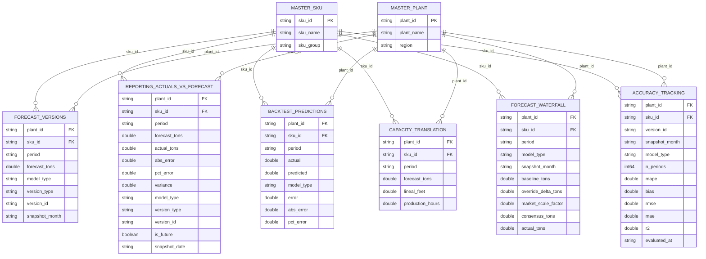

# IBP Forecast Model — Semantic Model Schema

DirectLake semantic model over `lh_ibp_gold`. Created and updated by notebook `15_refresh_semantic_model.py` via the Fabric REST API. Refreshed daily at 06:00 UTC by default.

> **Single source of truth**: All table schemas, BIM column definitions, DAX measures, and relationships below are defined in `schemas_module.py`. Notebook 15 calls `build_bim(sql_endpoint, lakehouse_name)` to generate the full BIM JSON — no inline schema definitions in any notebook.

## Entity Relationship Diagram



## Tables

### Dimension Tables

#### Master SKU

Product dimension — one row per unique SKU.

| Column | Type | Key | Summarize |
|--------|------|-----|-----------|
| `sku_id` | string | PK | none |
| `sku_name` | string | | none |
| `sku_group` | string | | none |

**Source**: `lh_ibp_gold.dbo.master_sku`

---

#### Master Plant

Plant/location dimension — one row per facility.

| Column | Type | Key | Summarize |
|--------|------|-----|-----------|
| `plant_id` | string | PK | none |
| `plant_name` | string | | none |
| `region` | string | | none |

**Source**: `lh_ibp_gold.dbo.master_plant`

---

### Fact Tables

#### Forecast Versions

All versioned forecasts across snapshot months. Contains system baselines, sales overrides, and market-adjusted versions. Grows over time as new snapshots are appended.

| Column | Type | Summarize | Description |
|--------|------|-----------|-------------|
| `plant_id` | string | none | FK → Master Plant |
| `sku_id` | string | none | FK → Master SKU |
| `period` | string | none | Forecast period (YYYY-MM-DD) |
| `forecast_tons` | double | sum | Forecasted demand in tons |
| `model_type` | string | none | Model that produced the forecast (sarima, prophet, var, exp_smoothing, lightgbm) |
| `version_type` | string | none | Layer type (system, sales_override, market_adjusted, consensus) |
| `version_id` | string | none | Unique version hash |
| `snapshot_month` | string | none | When the forecast was created |

**Source**: `lh_ibp_gold.dbo.forecast_versions`

**Measures**:

| Measure | DAX Expression | Format |
|---------|---------------|--------|
| Total Forecast Tons | `SUM('Forecast Versions'[forecast_tons])` | default |
| Avg Forecast Tons | `AVERAGE('Forecast Versions'[forecast_tons])` | `0.00` |

---

#### Reporting Actuals vs Forecast

Unified reporting view — outer join of forecasts and actuals with computed error metrics. The primary table for Power BI dashboards.

| Column | Type | Summarize | Description |
|--------|------|-----------|-------------|
| `plant_id` | string | none | FK → Master Plant |
| `sku_id` | string | none | FK → Master SKU |
| `period` | string | none | Period (YYYY-MM-DD) |
| `forecast_tons` | double | sum | Forecasted demand |
| `actual_tons` | double | sum | Actual demand (null for future periods) |
| `abs_error` | double | sum | \|forecast - actual\| |
| `pct_error` | double | none | abs_error / actual |
| `variance` | double | sum | forecast - actual (signed) |
| `model_type` | string | none | Model type |
| `version_type` | string | none | Layer type |
| `version_id` | string | none | Version hash |
| `is_future` | boolean | none | True if forecast has no matching actual |
| `snapshot_date` | string | none | When reporting view was built |

**Source**: `lh_ibp_gold.dbo.reporting_actuals_vs_forecast`

**Measures**:

| Measure | DAX Expression | Format |
|---------|---------------|--------|
| Total Actual Tons | `SUM('Reporting Actuals vs Forecast'[actual_tons])` | default |
| Total Variance | `SUM('Reporting Actuals vs Forecast'[variance])` | default |
| MAPE % | `DIVIDE(SUM([abs_error]),SUM([actual_tons]),BLANK())*100` | `0.0` |
| Bias % | `DIVIDE([Total Variance],[Total Actual Tons],BLANK())*100` | `0.0` |
| Forecast Accuracy % | `100-[MAPE %]` | `0.0` |
| Future Forecast Tons | `CALCULATE(SUM([forecast_tons]),[is_future]=TRUE())` | default |

---

#### Backtest Predictions

Historical backtest results — model predictions on held-out test data. Used to evaluate model accuracy before deploying forward forecasts.

| Column | Type | Summarize | Description |
|--------|------|-----------|-------------|
| `plant_id` | string | none | FK → Master Plant |
| `sku_id` | string | none | FK → Master SKU |
| `period` | string | none | Period (YYYY-MM-DD) |
| `actual` | double | sum | Actual value in the test set |
| `predicted` | double | sum | Model prediction |
| `model_type` | string | none | Model type |
| `error` | double | sum | predicted - actual (signed) |
| `abs_error` | double | sum | \|predicted - actual\| |
| `pct_error` | double | none | abs_error / actual |

**Source**: `lh_ibp_gold.dbo.backtest_predictions`

**Measures**:

| Measure | DAX Expression | Format |
|---------|---------------|--------|
| Backtest MAPE % | `DIVIDE(SUM([abs_error]),SUM([actual]),BLANK())*100` | `0.0` |
| Total Actual | `SUM('Backtest Predictions'[actual])` | `#,0.0` |
| Total Predicted | `SUM('Backtest Predictions'[predicted])` | `#,0.0` |

---

#### Forecast Waterfall

Wide-format view showing all forecast layers as columns in a single row per grain+period. This is the table the client uses to see baseline prediction alongside every modifier.

| Column | Type | Summarize | Description |
|--------|------|-----------|-------------|
| `plant_id` | string | none | FK → Master Plant |
| `sku_id` | string | none | FK → Master SKU |
| `period` | string | none | Forecast period (YYYY-MM-DD) |
| `model_type` | string | none | Statistical model used for baseline |
| `snapshot_month` | string | none | When the baseline was created |
| `baseline_tons` | double | sum | System baseline forecast (statistical model output) |
| `override_delta_tons` | double | sum | Sales team additive override (+/- tons) |
| `market_scale_factor` | double | none | Market adjustment multiplier (e.g. 1.05 = +5%) |
| `consensus_tons` | double | sum | Final consensus = (baseline + sales_delta) × market_factor |
| `actual_tons` | double | sum | Actual demand (null for future periods) |

**Source**: `lh_ibp_gold.dbo.forecast_waterfall`

**Measures**:

| Measure | DAX Expression | Format |
|---------|---------------|--------|
| Baseline Total | `SUM('Forecast Waterfall'[baseline_tons])` | `#,0.0` |
| Sales Override Total | `SUM('Forecast Waterfall'[override_delta_tons])` | `#,0.0` |
| Consensus Total | `SUM('Forecast Waterfall'[consensus_tons])` | `#,0.0` |
| Waterfall Actual | `SUM('Forecast Waterfall'[actual_tons])` | `#,0.0` |
| Net Adjustment % | `DIVIDE(SUM([consensus_tons])-SUM([baseline_tons]),SUM([baseline_tons]),BLANK())*100` | `0.0` |

---

#### Accuracy Tracking

Per-grain, per-snapshot accuracy metrics comparing prior forecast predictions against actuals. Evaluates both **system** (unmodified baseline) and **consensus** (with sales overrides + market adjustments) forecasts. Grows over time as new actuals arrive and the pipeline re-evaluates prior snapshots.

| Column | Type | Summarize | Description |
|--------|------|-----------|-------------|
| `plant_id` | string | none | FK → Master Plant |
| `sku_id` | string | none | FK → Master SKU |
| `version_id` | string | none | Forecast version hash |
| `snapshot_month` | string | none | When the forecast was originally made |
| `model_type` | string | none | Model that produced the forecast |
| `version_type` | string | none | `system` (baseline) or `consensus` (with modifiers) |
| `n_periods` | int64 | sum | Number of overlapping periods evaluated |
| `mape` | double | none | Mean Absolute Percentage Error |
| `bias` | double | none | Signed bias (forecast - actual) / actual |
| `rmse` | double | none | Root Mean Squared Error |
| `mae` | double | none | Mean Absolute Error |
| `r2` | double | none | R-squared |
| `evaluated_at` | string | none | ISO timestamp of evaluation |

**Source**: `lh_ibp_gold.dbo.accuracy_tracking`

**Measures**:

| Measure | DAX Expression | Format |
|---------|---------------|--------|
| Avg MAPE % | `AVERAGE('Accuracy Tracking'[mape])` | `0.0` |
| Avg Bias | `AVERAGE('Accuracy Tracking'[bias])` | `0.00` |
| Avg RMSE | `AVERAGE('Accuracy Tracking'[rmse])` | `0.00` |
| Avg MAE | `AVERAGE('Accuracy Tracking'[mae])` | `0.00` |
| Avg R² | `AVERAGE('Accuracy Tracking'[r2])` | `0.000` |
| Evaluations | `COUNTROWS('Accuracy Tracking')` | default |

---

#### Capacity Translation

Demand-to-capacity conversion — tons translated into lineal feet and production hours per plant/SKU/period.

| Column | Type | Summarize | Description |
|--------|------|-----------|-------------|
| `plant_id` | string | none | FK → Master Plant |
| `sku_id` | string | none | FK → Master SKU |
| `period` | string | none | Period (YYYY-MM-DD) |
| `forecast_tons` | double | sum | Forecasted demand |
| `lineal_feet` | double | sum | Converted to lineal feet |
| `production_hours` | double | sum | Converted to production hours |

**Source**: `lh_ibp_gold.dbo.capacity_translation`

**Measures**:

| Measure | DAX Expression | Format |
|---------|---------------|--------|
| Total Lineal Feet | `SUM('Capacity Translation'[lineal_feet])` | `#,0` |
| Total Production Hours | `SUM('Capacity Translation'[production_hours])` | `#,0.0` |

---

## Relationships

All relationships are single-direction, many-to-one, from fact tables to dimension tables.

| Name | From Table | From Column | To Table | To Column |
|------|-----------|-------------|----------|-----------|
| FK_FV_SKU | Forecast Versions | sku_id | Master SKU | sku_id |
| FK_FV_Plant | Forecast Versions | plant_id | Master Plant | plant_id |
| FK_Reporting_SKU | Reporting Actuals vs Forecast | sku_id | Master SKU | sku_id |
| FK_Reporting_Plant | Reporting Actuals vs Forecast | plant_id | Master Plant | plant_id |
| FK_Capacity_SKU | Capacity Translation | sku_id | Master SKU | sku_id |
| FK_Capacity_Plant | Capacity Translation | plant_id | Master Plant | plant_id |
| FK_Backtest_SKU | Backtest Predictions | sku_id | Master SKU | sku_id |
| FK_Backtest_Plant | Backtest Predictions | plant_id | Master Plant | plant_id |
| FK_Waterfall_SKU | Forecast Waterfall | sku_id | Master SKU | sku_id |
| FK_Waterfall_Plant | Forecast Waterfall | plant_id | Master Plant | plant_id |
| FK_Accuracy_SKU | Accuracy Tracking | sku_id | Master SKU | sku_id |
| FK_Accuracy_Plant | Accuracy Tracking | plant_id | Master Plant | plant_id |

## Data Source Expression

The DirectLake connection uses an M expression pointing to the gold lakehouse SQL endpoint:

```m
let
    database = Sql.Database("<sql_endpoint>", "lh_ibp_gold")
in
    database
```

The SQL endpoint and lakehouse name are resolved dynamically at runtime by notebook 15 using the Fabric REST API.

## Refresh Configuration

| Setting | Default | Description |
|---------|---------|-------------|
| Scheduled refresh | Enabled | Daily at 06:00 UTC |
| Refresh type | Full | All tables refreshed |
| Notification | MailOnFailure | Email on refresh failure |

Controlled via `ibp_config.py`: `refresh_schedule_enabled`, `refresh_schedule_time`, `refresh_schedule_timezone`.

## Models Represented

The `model_type` column across fact tables can contain any of the enabled models:

| Model | Training Style | Scoring Style |
|-------|---------------|---------------|
| `sarima` | Per grain | Direct (statsmodels forecast) |
| `prophet` | Per grain | Direct (Prophet predict) |
| `var` | Per grain | Direct (VAR forecast) |
| `exp_smoothing` | Per grain | Direct (Holt-Winters forecast) |
| `lightgbm` | Global pooled | Recursive (lag features recomputed per step) |

Which models appear depends on the `models_enabled` config list. Remove a model from the list to exclude it from training, scoring, and all downstream tables.
