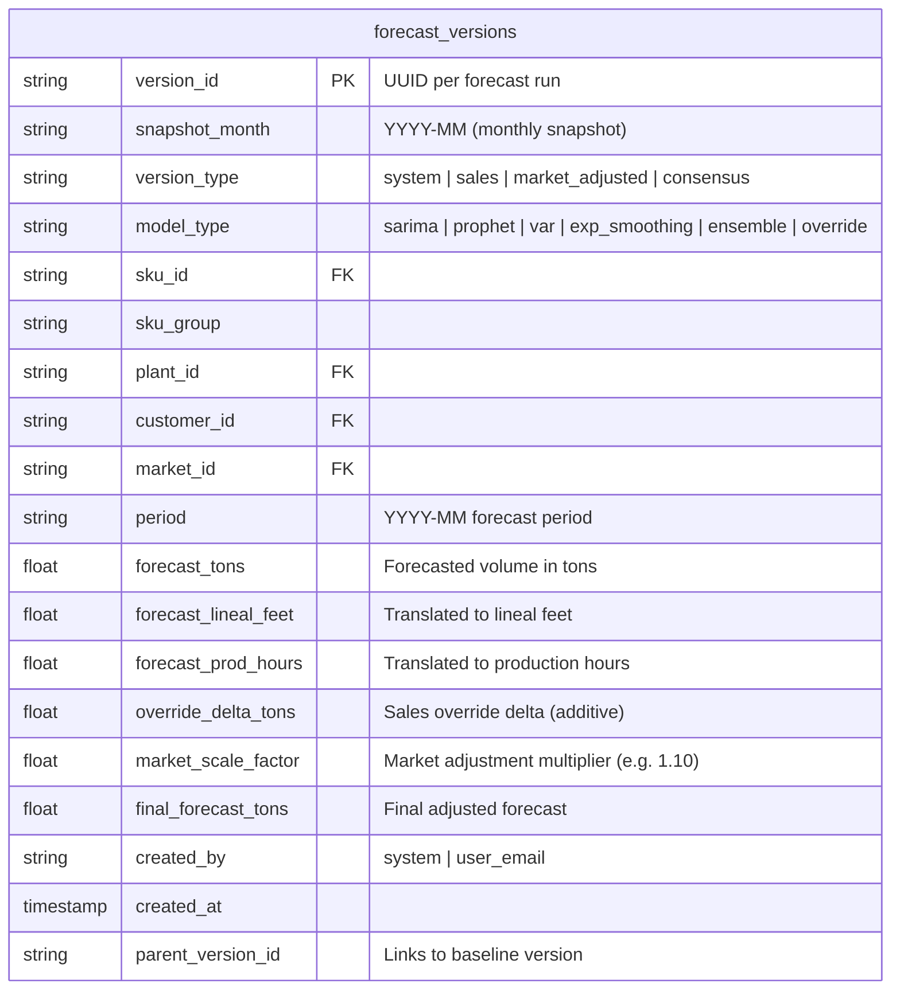
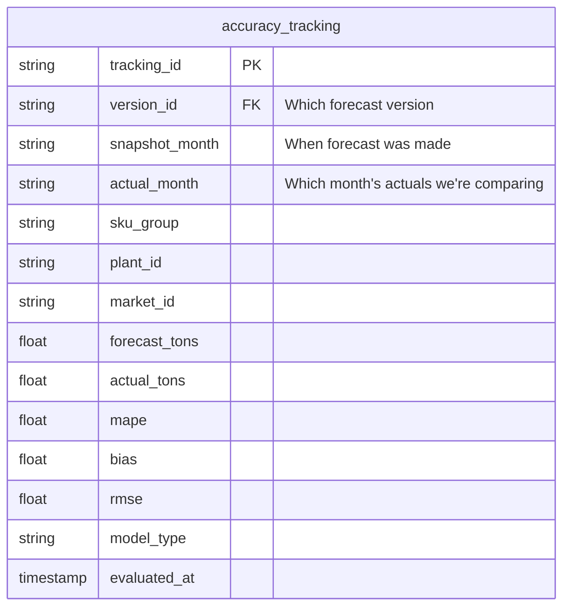
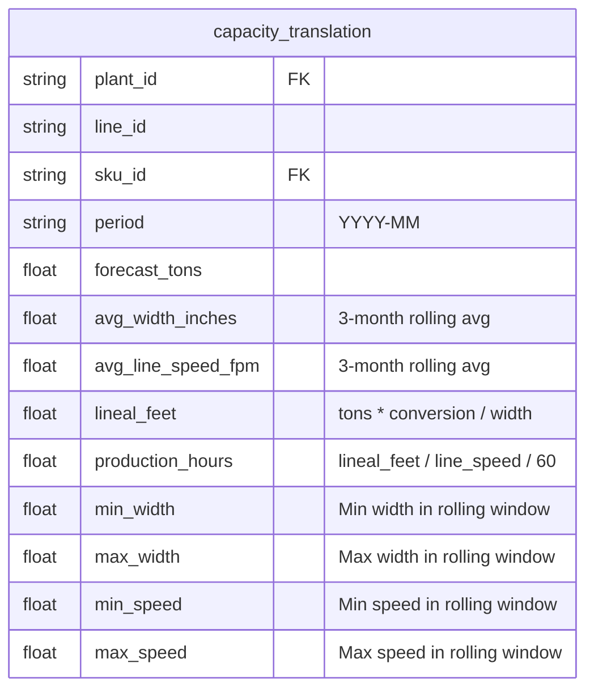
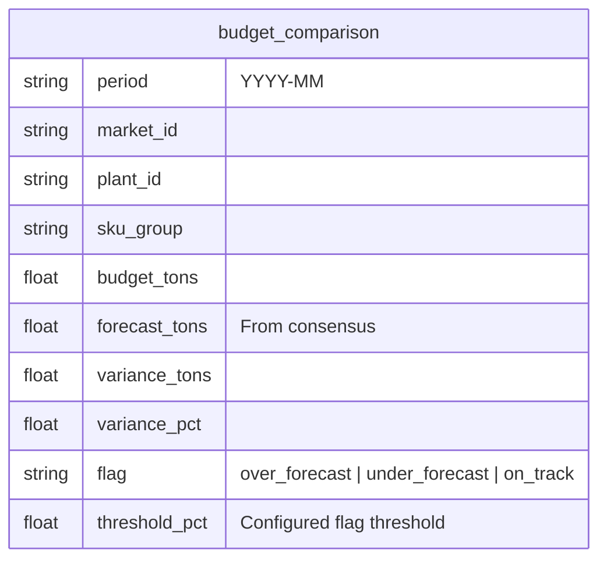

# Data Model -- Forecast Versioning & Layering

## Core Principle

Every forecast row carries a `version_id`, `version_type`, and `snapshot_month`. Statistical baselines are **never overwritten**. Sales overrides and market adjustments are separate, auditable layers.

## Forecast Table Schema (`forecast_versions`)

## Version Types

| Type | Source | Overwrites Baseline? | Description |
|------|--------|---------------------|-------------|
| `system` | Statistical models | N/A (IS the baseline) | Raw model output, frozen at creation |
| `sales` | Sales team input | No | Additive delta on top of `system` |
| `market_adjusted` | Market controls | No | Multiplicative scaling on `system` or `sales` |
| `consensus` | Finalization | No | Approved version = `system + sales_delta * market_factor` |

## Accuracy Tracking Schema (`accuracy_tracking`)

## Capacity Translation Schema (`capacity_translation`)

## Budget Comparison Schema (`budget_comparison`)

