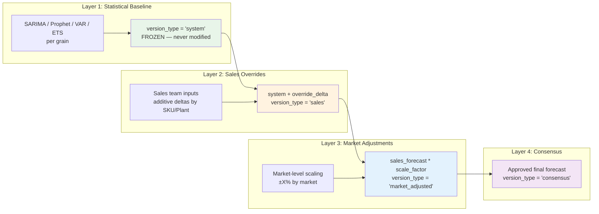
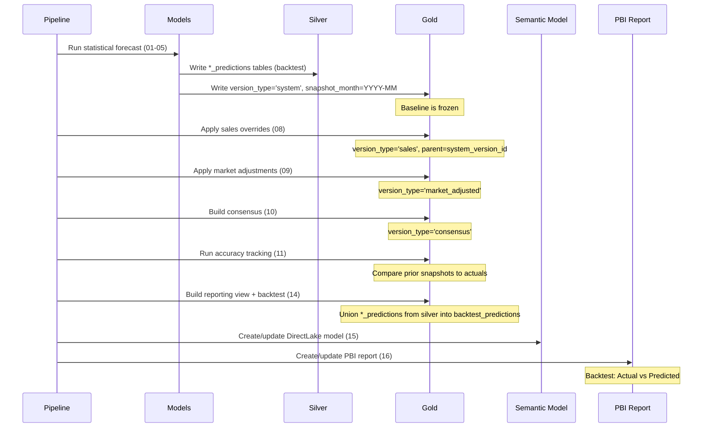

# Forecast Versioning & Layering Architecture

## Layering Flow



## Monthly Snapshot Process



## Accuracy Tracking Logic

1. For each prior `snapshot_month` where `version_type = 'system'`:
   - Find periods where actuals are now available
   - Compute MAPE = mean(|forecast - actual| / actual) per grain
   - Compute bias = mean(forecast - actual) per grain
   - Store in `accuracy_tracking` table
2. Results aggregated by SKU group, plant, market for model selection
3. Best-performing model per grain informs ensemble weights or model selection

## Drill-Down Hierarchy

```
Market
  └── Plant
        └── SKU Group
              └── SKU
                    └── Customer
```

Each level shows: system forecast, sales adjusted, consensus, budget, variance, flags.
