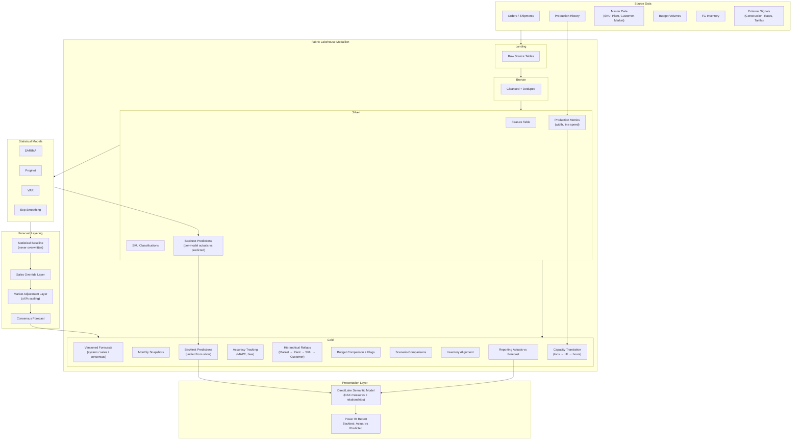

# System Overview

```mermaid
flowchart TB
    subgraph Sources["Source Data"]
        orders["Orders / Shipments"]
        production["Production History"]
        master["Master Data<br>(SKU, Plant, Customer, Market)"]
        budget["Budget Volumes"]
        inventory["FG Inventory"]
        external["External Signals<br>(Construction, Rates, Tariffs)"]
    end

    subgraph Medallion["Fabric Lakehouse Medallion"]
        subgraph Landing["Landing"]
            raw_tables["Raw Source Tables"]
        end
        subgraph Bronze["Bronze"]
            clean_tables["Cleansed + Deduped"]
        end
        subgraph Silver["Silver"]
            features["Feature Table"]
            prod_metrics["Production Metrics<br>(width, line speed)"]
            sku_class["SKU Classifications"]
            backtest_preds["Backtest Predictions<br>(per-model actuals vs predicted)"]
        end
        subgraph Gold["Gold"]
            forecasts["Versioned Forecasts<br>(system / sales / consensus)"]
            snapshots["Monthly Snapshots"]
            capacity["Capacity Translation<br>(tons → LF → hours)"]
            accuracy["Accuracy Tracking<br>(MAPE, bias)"]
            hierarchy["Hierarchical Rollups<br>(Market → Plant → SKU → Customer)"]
            budget_comp["Budget Comparison + Flags"]
            scenarios["Scenario Comparisons"]
            inv_alignment["Inventory Alignment"]
            reporting["Reporting Actuals vs Forecast"]
            backtest_gold["Backtest Predictions<br>(unified from silver)"]
        end
    end

    subgraph Models["Statistical Models"]
        sarima["SARIMA"]
        prophet["Prophet"]
        var["VAR"]
        ets["Exp Smoothing"]
    end

    subgraph Layers["Forecast Layering"]
        baseline["Statistical Baseline<br>(never overwritten)"]
        sales_adj["Sales Override Layer"]
        market_adj["Market Adjustment Layer<br>(±X% scaling)"]
        consensus["Consensus Forecast"]
    end

    subgraph Presentation["Presentation Layer"]
        semantic["DirectLake Semantic Model<br>(DAX measures + relationships)"]
        report["Power BI Report<br>Backtest: Actual vs Predicted"]
    end

    Sources --> Landing
    Landing --> Bronze
    Bronze --> Silver
    Silver --> Models
    Models --> baseline
    Models --> backtest_preds
    baseline --> sales_adj
    sales_adj --> market_adj
    market_adj --> consensus
    consensus --> Gold
    Silver --> Gold
    production --> prod_metrics
    prod_metrics --> capacity
    backtest_preds --> backtest_gold
    reporting --> semantic
    backtest_gold --> semantic
    semantic --> report
```
